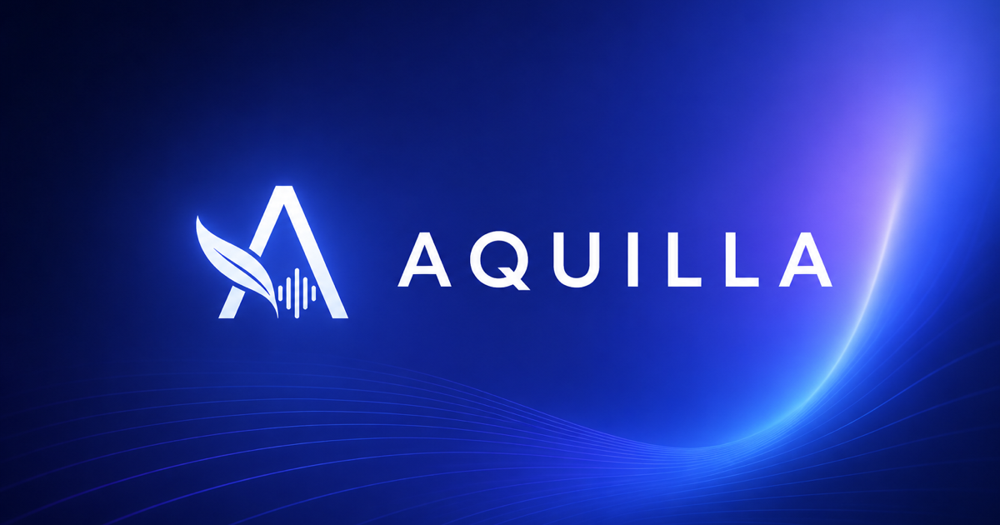

# Aquilla

**An agentic translation system for managing and completing translation work
in the age of AI.**

Aquilla brings translators, reviewers, and AI agents into one shared workspace.
You organize the work, build its context, run translation workflows, and review
the results through to delivery.

Context management sits at the center. Project briefs, terminology, style rules,
approved translations, reference material, and durable project memory help models
translate within your team's language, audience, and goals.

For highly specific styles and low-resource languages, your team's linguistic
knowledge needs to travel with every task. Aquilla makes that knowledge reusable
across drafting, checking, revision, and collaboration.

[Explore Aquilla](https://aquilla.app) ·
[Run your own installation](docs/SELF-HOSTING.md) ·
[Read the documentation](docs/README.md)


*A real local demo of the translation workspace: John 1, English to French,
with translated and human-validated cells side by side.*

## Context that guides the translation

You define what a good translation means for this project. Aquilla carries that
context into the work through several complementary mechanisms:

- **Translation briefs:** capture purpose, audience, target variety, register,
  key terms, constraints, and the quality standard your team expects.
- **Terminology and style rules:** record agreed renderings and language-specific
  conventions, then check translations against them.
- **Approved translation examples:** retrieve reviewed source–target pairs from
  the active translation lane as examples for new drafts.
- **Document context:** use preceding approved translations and surrounding
  source text to preserve continuity across cells and passages.
- **Living memory and reference material:** preserve approved project knowledge
  and let agents retrieve the details they need for a task.
- **Contextual workflows:** analyze passages, build scene briefs, draft, check,
  and stage results with visible progress and review boundaries.

Human-approved material and unreviewed drafts have distinct roles. Approved
examples guide retrieval; drafts produced within a run remain labeled as drafts.
Agents can propose durable memory and brief updates for human review.

## Manage the work from source to delivery

- **Work with agents:** ask them to inspect the project, find relevant examples,
  draft translations, check work, and propose changes.
- **Review and revise:** inspect staged drafts, apply proposed changes, discuss
  choices in comments, and validate translations with your team.
- **Translate across media:** work with text, audio, transcripts, and timed
  content, with recording and speech tools where configured.
- **Coordinate your team:** manage organizations, projects, access, assignments,
  and progress in a collaborative workspace.
- **Keep working through connection gaps:** edit locally and sync pending changes
  when your connection returns.
- **Deliver usable artifacts:** import and export translation files while
  preserving the structure each supported format requires.

Bible translation is a core use case. Aquilla supports scripture workflows,
back-translation, and terminology management, with USFM/Paratext import–export
fidelity as a product requirement. The context and agent workflows also support
document and multimedia translation projects.

## Stack

| Layer | Tech |
|---|---|
| SPA | React 19 + Vite 8, TypeScript, Tailwind 4, shadcn/base-ui |
| App edge | Cloudflare Worker (`worker/`) — serves SPA routes and invite unfurls |
| Identity | Cloudflare Worker (`auth-worker/`) — Hono, Neon Postgres via Hyperdrive |
| Sync | Cloudflare Worker (`sync-worker/`) — event log + projection writer + ProjectSync DO |
| Data | Neon Postgres (live); Docker `postgres:16` locally |
| Media | Cloudflare R2 (audio blobs) |
| Desktop | Tauri shell (`src-tauri/`) |

Architecture: event-sourced CQRS. Client → IndexedDB outbox → `POST /events` →
sync-worker projects into `cells`/`files` tables → ProjectSync DO broadcasts to
WebSocket clients. Start with the [self-hosting guide](docs/SELF-HOSTING.md),
[documentation index](docs/README.md),
[system specification](docs/SPEC.md), and
[deployment environment matrix](docs/DEPLOYMENT-ENVIRONMENTS.md).

The public homepage, legal pages, case studies, sitemap, and robots policy live
in the sibling `aquilla-marketing` repository and deploy independently through
more-specific Cloudflare zone routes. This repository builds the SPA only.

## Fresh-clone setup

Install the frontend and both core backend packages. Each has its own dependencies:

```bash
pnpm install
pnpm --dir auth-worker install
pnpm --dir sync-worker install
```

For optional local agent code execution and AI import parsing, also install
the sandbox package:

```bash
pnpm --dir agent-worker install
```

Copy the env template and fill in your secrets:

```bash
cp .env.example .env.local
```

**Docker must be running.** `pnpm dev` spins a `postgres:16` container named
`aquilla-dev-pg` on port 5432 and applies the schema automatically on first boot.

## Running locally

```bash
pnpm dev        # starts auth-worker (8788) + sync-worker (8789) + Vite (5173)
```

The script (`scripts/dev-stack.ts`) wires `VITE_AUTH_BASE` / `VITE_SYNC_WORKER_HOST`
/ `VITE_CHAT_BASE` to the local worker ports automatically.

Dev login bypass: navigate to `http://127.0.0.1:5173/__dev/login` — seeds a `dev`
user and redirects to `/project/dev-project`.

## Tests

```bash
pnpm test                # unit tests (vitest)
pnpm test:e2e:affected   # changed-file gate used by pre-push; normally a few specs
pnpm test:e2e:smoke      # complete smoke suite — merge/deploy/release gate
pnpm test:e2e            # full Playwright suite (requires Docker)
```

> **Note:** pre-push selects changed journey specs plus a small domain sentinel
> set and uses one fast dev-mode stack. The complete three-shard smoke pass is
> still required for merge/deploy/release validation; see
> [e2e/README.md](e2e/README.md).

> **Note:** `pnpm test:e2e` (via `scripts/e2e-up.ts`) uses its own ports
> (6173 / 9787 / 9788 for shard 0) and frees them on shutdown. It does not
> take over a live `pnpm dev` stack. See [e2e/README.md](e2e/README.md).

Worker test suites (run separately, each uses PGlite — no Docker needed):

```bash
cd auth-worker  && pnpm test
cd sync-worker  && pnpm test
```

## Deploy scripts

Scripts follow the pattern `pnpm run deploy:<brand>:<target>`:

| Command | What it does |
|---|---|
| `pnpm run deploy:aquilla` | Build SPA + deploy all three workers to production |
| `pnpm run deploy:aquilla:spa` | SPA only |
| `pnpm run deploy:aquilla:auth` | auth-worker only |
| `pnpm run deploy:aquilla:sync` | sync-worker only |
| `pnpm run deploy:aquilla:dev` | Full development deploy (dev.aquilla.app) |
| `pnpm run verify:live:development` | Verify development DNS, TLS, API routes, and SPA targets |
| `pnpm run deploy:codex` | Codex brand to Cloudflare Pages |
| `pnpm run deploy:honeycomb` | Honeycomb brand |
| `pnpm run deploy:context` | Context brand |

Production and development mappings are defined in
[docs/DEPLOYMENT-ENVIRONMENTS.md](docs/DEPLOYMENT-ENVIRONMENTS.md). Live Aquilla
deploys always pass an explicit named Wrangler environment; do not use a bare
`wrangler deploy`. Unnamed Wrangler profiles are local-only. Production deploys
use a `release/YYYY/MM/DD` branch; development deploys use `dev`. The named
production profile runs a branch guard before upload.

These scripts target Aquilla's own deployment. For your own accounts, domains,
and services, follow the [self-hosting guide](docs/SELF-HOSTING.md).

## Multi-brand build system

Aquilla ships four brand skins from one codebase. Set `BRAND` at build time:

```bash
BRAND=aquilla    pnpm build     # default; falls back to aquilla on unknown value
BRAND=codex      pnpm build:codex
BRAND=honeycomb  pnpm build:honeycomb
BRAND=context    pnpm build:context
```

Each build script runs `scripts/check-brand-build.ts` after `vite build` to assert
that the correct title, favicon, and theme token appear in `dist/index.html`. A wrong
`BRAND` value silently falls back to `aquilla` (with a console warning), so verify the
output with the check script if brand-switching is load-bearing.

Valid brand IDs are defined in `src/branding/brands/data.ts`.
