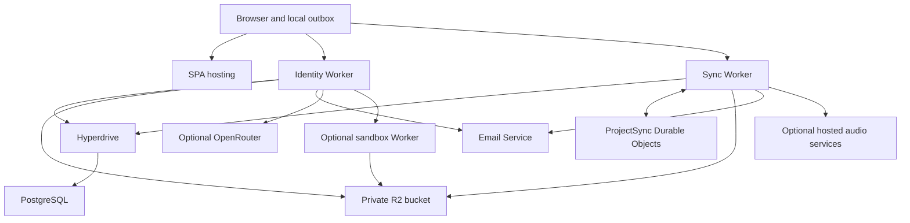

# Aquilla self hosting guide

You can run your own Aquilla installation using your Cloudflare account,
PostgreSQL database, domain, and optional AI services.

This guide covers local evaluation, an independent Cloudflare deployment,
optional services, verification, backups, upgrades, and a deployment without
Cloudflare. We describe the implementation checked on October 1, 2026, at
commit `ffbe071c9`. Pin that revision when reproducing the database bootstrap
below; revalidate it before using another revision.

**Current limitation:** Aquilla does not ship a production Docker Compose
stack or a supported single-server backend. Its deployed backend uses
Cloudflare bindings directly. A private-server deployment requires engineering
work; installing PostgreSQL and serving the frontend does not replace it.

## Choose your deployment

| Option | What you operate | Current status |
| --- | --- | --- |
| Local evaluation | Vite, local Workers, Docker PostgreSQL, simulated R2 and Durable Objects | Existing development setup; includes authentication bypasses |
| Independent Cloudflare installation | Your Workers, Durable Objects, Hyperdrive, R2, database, domain, and email | Matches the current architecture; requires your own deployment configuration |
| Private infrastructure only | Web hosting, application servers, real-time coordination, PostgreSQL, object storage, email, and optional model servers | Requires adapters and deployment tooling that this repository does not provide |

For the second option, you control accounts, credentials, data, deployments,
and costs. Cloudflare still runs the application runtime. Neon is optional:
Hyperdrive can connect to another compatible PostgreSQL service.

## Understand the architecture



- The React SPA runs in your browser. IndexedDB holds local state and an outbox
  of events waiting to sync.
- `auth-worker/` owns accounts, sessions, organizations, permissions, invites,
  administrative APIs, and the AI proxy and agent harness.
- `sync-worker/` accepts events, writes the PostgreSQL event log, and updates
  file and cell projections. It also handles media and several audio services.
- `ProjectSync` Durable Objects coordinate presence, focus locks, and event
  broadcasts. They do not store the authoritative event or projection data.
- Both Workers connect through `HYPERDRIVE` to the **same PostgreSQL database**.
- The `SNAPSHOTS` R2 binding stores audio, import sources, and agent artifacts.
  Despite its name, this bucket does not contain the authoritative event log.
- `agent-worker/` runs isolated code in Cloudflare Sandbox containers. The
  identity Worker calls it server-side; browsers do not receive its secret.

The chat API lives in the identity Worker. You do not deploy a separate chat
Worker. D1 and the old GitLab identity bridge are not required for a new install.

## Services and accounts you need

| Service | Requirement | Purpose |
| --- | --- | --- |
| Source repository | Required | Application, Workers, schema, tests, and deployment configuration |
| Cloudflare account | Required for the Cloudflare deployment | Workers, routes, Durable Objects, Hyperdrive, and R2 |
| PostgreSQL | Required | Accounts, permissions, events, files, cells, and application records |
| R2 bucket | Required for the complete application | Private media, source imports, and agent artifacts |
| Domain and DNS | Required for the production layout below | HTTPS app and API hosts; dependable WebSocket access |
| Transactional email | Required for complete account operations | Password recovery, invitations, verification, and administrator elevation |
| OpenRouter | Optional | Hosted AI completion, translation agents, contextual processing, and AI import classification |
| Cloudflare Sandbox containers | Optional | Agent code execution and AI parsing of unfamiliar import formats |
| Inworld | Optional | Hosted speech generation and instant voice cloning |
| Modal GPU services | Optional | Speaker diarization and Seed-VC voice conversion |
| Hugging Face or a model mirror | Optional | Browser-loaded MMS speech models and model downloads |
| PostHog | Optional | Analytics and Worker log shipping |
| Monday.com, Google Drive, Stripe | Optional | Project integration, Drive import, and subscription billing |

For sandbox execution, Cloudflare currently requires a Workers Paid plan.
Check your account's limits and service availability before provisioning.
See [Cloudflare Sandbox documentation](https://developers.cloudflare.com/sandbox/).

GitHub Actions and a Hetzner test runner are not runtime dependencies. The
Tauri desktop shell is also optional. You can operate the browser application
without building desktop installers.

## Run Aquilla locally

Use Node.js 22, the repository's pinned pnpm version (`10.19.0`), Git, and Docker.
The repository's CI uses Node.js 22. Docker must run before you start the stack.

From a checkout of Aquilla:

```bash
pnpm install --frozen-lockfile
pnpm --dir auth-worker install --frozen-lockfile
pnpm --dir sync-worker install --frozen-lockfile
pnpm --dir agent-worker install --frozen-lockfile
cp .env.example .env.local
pnpm dev
```

The agent-worker install supplies the optional local sandbox. If you do not
need that service, start with `pnpm dev -- --no-sandbox`.

| Component | Default local address |
| --- | --- |
| Frontend | `http://127.0.0.1:5173` |
| Identity and chat | `http://127.0.0.1:8788` |
| Sync | `http://127.0.0.1:8789` |
| PostgreSQL | `127.0.0.1:5432`, container `aquilla-dev-pg` |

Open `http://127.0.0.1:5173/__dev/login` to seed the development account and
enter `dev-project`. The stack generates the local frontend endpoints and
copies backend `.dev.vars.example` files when necessary.

Without a real OpenRouter key, the development stack normally starts a scripted
mock AI service. Put your key in `auth-worker/.dev.vars` for real model calls.
Use `--no-mock-llm` to exercise the missing-provider behavior instead.

PostgreSQL stores local application data. Wrangler persists simulated R2 and
Durable Object state under `.wrangler-dev-state/`. Preserve both if local media
matters. Stop the stack with Ctrl+C.

**Keep this stack private.** Its generated settings enable development and test
routes. Never expose `pnpm dev` as your production service, connect it to a
production database, or deploy `WRANGLER_LOCAL=1`.

## Prepare an independent Cloudflare installation

Use a fork or deployment checkout that you control. Preserve the upstream
configuration as a reference and create separate self-host configuration files.

The examples use these names:

| Resource | Example |
| --- | --- |
| Frontend | `https://app.example.org` |
| API | `https://api.example.org` |
| Identity Worker | `my-aquilla-identity` |
| Sync Worker | `my-aquilla-sync` |
| Web Worker | `my-aquilla-web` |
| R2 bucket | `my-aquilla-blobs` |
| Wrangler environment | `selfhost` |

Replace `example.org`, account IDs, resource IDs, email addresses, and Worker
names with your own values. Obtain source access separately if the repository
is private; this guide does not provide repository credentials.

Install dependencies as shown in the local setup. Install PostgreSQL client
tools for `psql`, `pg_dump`, and `pg_restore`. Authenticate Wrangler against
your account, or supply a Cloudflare API token scoped to your deployment.
Include permissions for the resources you create and the zone routes you own.

Do not run the upstream `deploy:aquilla*` scripts for this installation. They
select Aquilla's domains, account resources, release branches, and deployment
manifest. Its `verify:live:*` commands also target Aquilla's own environments.

### Provision PostgreSQL

Create an empty database dedicated to this installation. The repository uses
PostgreSQL 16 locally, while the schema targets Neon PostgreSQL 18. Validate your
chosen provider and version with the application tests.

Use TLS for remote database connections. Choose a region near your Worker
database access and enable backups or point-in-time recovery. Ensure Hyperdrive
can reach the database through a supported public or private connection.

Keep separate credentials for migration operations and routine application
access. The migration account needs DDL permissions and permission to create
the `app_runtime` role used by the security migrations.

**Database-role limitation:** the RLS documentation records incomplete grants
for `app_runtime` on normal application paths. Simply switching Hyperdrive to
that role can cause permission failures. Conversely, table-owner connections
bypass ordinary RLS policies. Resolve the grants and verify every required
path before claiming that database RLS enforces tenant isolation. See
[the RLS deployment status](../db/postgres/RLS.md).

### Initialize a fresh database

This procedure applies **only to an empty database at the documented revision**.
It does not migrate an existing installation or import Aquilla's hosted data.

`db/postgres/schema.sql` contains the current schema, but security policies and
grants also live in migrations. `neon:baseline` checks those contracts before
recording migration history. Loading only `schema.sql` is therefore insufficient.

Historical migrations include destructive operations and non-idempotent DDL.
Do not replay the full directory on an existing database. At this revision,
nine files duplicate changes already included in the current schema.

Load the following credentials through your secret manager or a private shell
session. `SELFHOST_OWNER_DATABASE_URL` is your direct PostgreSQL owner URL.
The `NEON_PG_*` variables configure the repository's migration tools; their
names do not require you to use Neon.

```bash
export SELFHOST_OWNER_DATABASE_URL='<direct-owner-postgresql-url>'
export NEON_PG_HOST='<direct-database-host>'
export NEON_PG_DB='<database-name>'
export NEON_PG_ROLE='<migration-owner-role>'
export NEON_PG_PASSWORD='<migration-owner-password>'
```

The direct-host helper uses port 5432 and verified TLS. A provider with another
port or certificate setup needs an adjusted connection configuration.

First confirm that your target has no user tables:

```bash
psql "$SELFHOST_OWNER_DATABASE_URL" -v ON_ERROR_STOP=1 -c \
  "SELECT schemaname, tablename FROM pg_tables
   WHERE schemaname NOT IN ('pg_catalog', 'information_schema');"
```

Stop if the query returns application tables. For an empty target, load the
schema and replay the remaining migration files in filename order:

```bash
psql "$SELFHOST_OWNER_DATABASE_URL" -v ON_ERROR_STOP=1 \
  -f db/postgres/schema.sql

(
  set -eu
  export LC_ALL=C
  for migration in db/postgres/migrations/*.sql; do
    case "$(basename "$migration")" in
      0043_org_invites.sql|0044_email_verification.sql|\
      0047_platform_settings_and_admin_elevation.sql|\
      0048_model_ab_events.sql|0049_model_ab_edit_distance.sql|\
      0054_settings_language_generated_columns.sql|\
      0072_project_manager.sql|0073_cell_links.sql|\
      0080_auth_token_hashing.sql)
        continue
        ;;
    esac
    psql "$SELFHOST_OWNER_DATABASE_URL" -v ON_ERROR_STOP=1 \
      -f "$migration"
  done
)

pnpm neon:baseline
pnpm neon:status
```

Run these commands in sequence and stop on any failure. Do not run baseline
after a failed replay until you investigate it. Baseline records history; it
does not execute migrations or repair the database.

We checked the schema-plus-filtered-migrations sequence in a fresh PGlite
PostgreSQL instance. It produces no schema-contract differences at this
revision. This check does not prove your provider's permissions, TLS,
connection limits, or deployed application behavior. Validate those separately.

For another revision, review every skipped file against its schema and rerun
the bootstrap check. Do not reuse this exception list without that review.

### Create Hyperdrive and R2

Create one Hyperdrive configuration for the application database and bind its
ID to both identity and sync Workers. Disable query caching for correct
read-after-write behavior. Hyperdrive enables query caching by default; see
[Hyperdrive query caching](https://developers.cloudflare.com/hyperdrive/concepts/query-caching/).

For example, after putting your runtime connection URL in
`SELFHOST_RUNTIME_DATABASE_URL`:

```bash
pnpm exec wrangler hyperdrive create my-aquilla-db \
  --connection-string="$SELFHOST_RUNTIME_DATABASE_URL" \
  --caching-disabled

pnpm exec wrangler r2 bucket create my-aquilla-blobs
```

Treat connection URLs as secrets. Where command arguments are logged, use the
Cloudflare dashboard or another credential-safe provisioning method instead.

Use the returned Hyperdrive ID in the configurations below. Keep the application
R2 bucket private. Identity, sync, and sandbox must use the same bucket and
compatible key prefixes within one environment.

Do not copy the upstream `LFS_SRC` bucket into a new deployment. It exists for
legacy audio migration. You need it only when migrating that particular source.

### Configure identity and chat

Create `auth-worker/wrangler.selfhost.toml`. Keeping it inside `auth-worker/`
preserves the relative path to `src/index.ts`.

```toml
name = "my-aquilla-identity-local"
main = "src/index.ts"
compatibility_date = "2025-05-01"
compatibility_flags = ["nodejs_compat"]

[env.selfhost]
name = "my-aquilla-identity"
account_id = "<your-cloudflare-account-id>"
workers_dev = true
routes = [
  "api.example.org/identity/*",
  "api.example.org/chat/*",
]

[env.selfhost.observability]
enabled = true

[[env.selfhost.hyperdrive]]
binding = "HYPERDRIVE"
id = "<your-hyperdrive-id>"

[[env.selfhost.r2_buckets]]
binding = "SNAPSHOTS"
bucket_name = "my-aquilla-blobs"

[[env.selfhost.send_email]]
name = "EMAIL"

[env.selfhost.vars]
ENVIRONMENT = "production"
DEPLOYMENT_WORKER_NAME = "my-aquilla-identity"
ALGORITHM = "HS256"
ACCESS_TOKEN_EXPIRE_MINUTES = "20160"
BASE_URL = "https://app.example.org"
BASE_URL_API = "https://api.example.org/identity"
SYNC_WORKER_URL = "https://api.example.org/sync"
EMAIL_FROM = "noreply@mail.example.org"
EMAIL_REPLY_TO = "support@example.org"
CONTACT_EMAIL = "support@example.org"
LEGACY_USER_MIGRATION_ENABLED = "false"
ADMIN_REQUIRE_ELEVATION = "true"
```

Add `DEFAULT_LLM_MODEL` and other provider settings only after selecting models
available through your own provider account. Add `LANE_READ_WALL = "1"` when
you want the deployed lane-access policy and have verified lane grants. Existing
data needs the lane-grant backfill before you enable it.

This minimal profile intentionally has no cron triggers. The existing scheduled
identity guard checks Aquilla's deployment manifest, Worker name, URLs, and
version tag. Copying its crons into this profile causes scheduled work to fail
that guard. If you need Monday push flushing or retention reports, adapt the
manifest and guard to your installation, provision version metadata, then add
and test the corresponding triggers. Keep deployed-environment safety checks.

### Configure sync and real-time collaboration

Create `sync-worker/wrangler.selfhost.toml`:

```toml
name = "my-aquilla-sync-local"
main = "src/index.ts"
compatibility_date = "2024-12-01"
compatibility_flags = ["nodejs_compat"]

[env.selfhost]
name = "my-aquilla-sync"
account_id = "<your-cloudflare-account-id>"
workers_dev = true
routes = ["api.example.org/sync/*"]

[env.selfhost.observability]
enabled = true

[[env.selfhost.hyperdrive]]
binding = "HYPERDRIVE"
id = "<your-hyperdrive-id>"

[[env.selfhost.r2_buckets]]
binding = "SNAPSHOTS"
bucket_name = "my-aquilla-blobs"

[[env.selfhost.durable_objects.bindings]]
name = "ProjectSync"
class_name = "ProjectSync"

[[env.selfhost.migrations]]
tag = "v1"
new_sqlite_classes = ["FileSync"]

[[env.selfhost.migrations]]
tag = "v2"
new_sqlite_classes = ["ProjectSync"]

[[env.selfhost.send_email]]
name = "EMAIL"

[env.selfhost.vars]
ENVIRONMENT = "production"
DEPLOYMENT_WORKER_NAME = "my-aquilla-sync"
AUTH_WORKER_URL = "https://api.example.org/identity"
BASE_URL = "https://app.example.org"
EMAIL_FROM = "noreply@mail.example.org"
```

Preserve the Durable Object migration history. The legacy `FileSync` class is
still exported so that history remains valid. Do not rename or reset migration
tags when upgrading an existing Worker namespace.

Do not set `ALLOW_UNAUTHENTICATED=true`. Sync rejects that bypass in deployed
production and development environments.

### Provision secrets

Generate separate high-entropy values for the following purposes:

| Secret | Where you provision it | Matching rule |
| --- | --- | --- |
| `SECRET_KEY` | Identity | Separate from all other secrets |
| `SYNC_SECRET_KEY` | Identity and sync | Identical within one environment |
| `ADMIN_SECRET` | Identity and sync | Identical within one environment; separate from signing keys |
| `OPENROUTER_API_KEY` | Identity, if AI is enabled | Your own provider account |
| `AGENT_SANDBOX_KEY` | Identity and sandbox, if enabled | Identical within one environment |

Secrets attach to Worker names. Named environments do not share secrets
automatically. For an independent test environment, use separate values and
separate databases and buckets.

For example, from the repository root:

```bash
pnpm --dir auth-worker exec wrangler secret put SECRET_KEY \
  --config wrangler.selfhost.toml --env selfhost

pnpm --dir auth-worker exec wrangler secret put SYNC_SECRET_KEY \
  --config wrangler.selfhost.toml --env selfhost

pnpm --dir sync-worker exec wrangler secret put SYNC_SECRET_KEY \
  --config wrangler.selfhost.toml --env selfhost

pnpm --dir auth-worker exec wrangler secret put ADMIN_SECRET \
  --config wrangler.selfhost.toml --env selfhost

pnpm --dir sync-worker exec wrangler secret put ADMIN_SECRET \
  --config wrangler.selfhost.toml --env selfhost
```

Use Wrangler's interactive prompts or your secret manager. When piping a value,
use `printf %s`, because `echo` adds a newline. Verify secret names with
`wrangler secret list` using the same configuration and environment.

Provision both copies of `ADMIN_SECRET` together. A mismatch can leave deleted
files' blobs in R2 because identity cannot authenticate its cleanup request.

Never place private keys in `VITE_*` variables. Vite publishes those values in
the browser bundle. Never deploy the example development secrets.

### Configure email

Aquilla currently sends transactional mail through Cloudflare Email Service's
`EMAIL` binding. It does not select an SMTP server through a generic environment
variable. Using another provider requires an email-service adapter.

Onboard your sending domain and apply Cloudflare's required DNS records. Use
your own `EMAIL_FROM`, reply inbox, contact inbox, and app URL. Confirm your
binding and account support the intended recipients, including external users.
Sender and destination restrictions matter; see
[Email Service bindings](https://developers.cloudflare.com/email-service/configuration/send-bindings/)
and [domain configuration](https://developers.cloudflare.com/email-service/configuration/domains/).

Without email, registration still creates a session. Verification and welcome
emails are best effort. Invitations and password recovery cannot deliver their
messages, and administrator elevation cannot send its code. A password-reset
response can remain generic even when delivery fails; verify actual receipt.

The upstream deployment manifest still names `RESEND_API_KEY` among required
secrets, while the transactional sender uses `EMAIL`. That is an upstream
deployment requirement, not proof that a new instance needs Resend for mail.
Resend newsletter integration has separate, optional credentials.

### Configure DNS and HTTPS

Add `app.example.org` and `api.example.org` to your Cloudflare DNS zone. Use
proxied records suitable for Workers routes and let Cloudflare provision TLS.
The route patterns in the examples require the matching zone in your account.

| Public path | Worker |
| --- | --- |
| `app.example.org/*` | Web |
| `api.example.org/identity/*` | Identity |
| `api.example.org/chat/*` | Identity |
| `api.example.org/sync/*` | Sync |

Identity strips `/identity` and `/chat` before routing. Sync strips `/sync`.
Preserve those prefixes consistently in frontend settings and server URLs.
WebSocket upgrades must reach the sync Worker without a challenge or login
page from an intermediate proxy.

The API uses bearer tokens and permits cross-origin browser access. A separate
API subdomain matches the existing architecture. CORS is not authentication.
If you narrow allowed origins, test HTTP requests, preflights, streaming AI
responses, and collaboration together.

Use HTTPS in production. Browser recording and several browser APIs depend on
secure contexts. A private R2 bucket does not need browser-wide CORS merely
because Workers read it; separately hosted model files may need public CORS.

### Build and host the frontend

Set the following build-time values in `.env.production.local` or your build
environment. Ensure your build has no development endpoint overrides.

```dotenv
VITE_AUTH_BASE=https://api.example.org/identity
VITE_CHAT_BASE=https://api.example.org/chat
VITE_SYNC_WORKER_HOST=api.example.org/sync
VITE_SUPPORT_EMAIL=support@example.org
VITE_DOCS_URL=https://docs.example.org
```

`VITE_SYNC_WORKER_HOST` has no URL scheme and no trailing slash. The other API
bases include their scheme. Changing these values requires another SPA build.

Build with the real repository gate:

```bash
BRAND=aquilla pnpm build
rm -f dist/_redirects
```

`pnpm build` includes IDML checks, `tsc -b`, Vite, and artifact checks. Do not
substitute `tsc --noEmit`. The default IDML stage is experimental; higher stages
require the corresponding browser, migration, and Adobe validation evidence.

Workers static assets reject the legacy SPA `_redirects` rule. Remove that
generated file for Workers deployment and retain `dist/_headers`.

Create `wrangler.selfhost.toml` in the repository root:

```toml
name = "my-aquilla-web-local"
main = "worker/index.ts"
compatibility_date = "2025-05-01"

[env.selfhost]
name = "my-aquilla-web"
account_id = "<your-cloudflare-account-id>"
workers_dev = true
routes = ["app.example.org/*"]

[env.selfhost.observability]
enabled = true

[env.selfhost.assets]
directory = "./dist"
binding = "ASSETS"
not_found_handling = "single-page-application"
```

The existing web Worker identifies `aquilla.app` as its canonical hostname.
Your custom domain receives its non-canonical indexing behavior when handled
by that Worker. Review the canonical host, social metadata, and support links
for your deployment. Keep frontend security headers and their tests aligned.

You can also host the built SPA on another static host. Configure fallback to
`index.html` for application routes, real 404s for missing assets, HTTPS, and
the response headers in `public/_headers`. Worker-only invite metadata behavior
requires equivalent server handling if you want it on another host.

The marketing site lives in the separate `aquilla-marketing` repository. It
does not belong to the core deployment. Deploy your own public pages separately
if you need them; avoid routes that accidentally hide the application's root.

### Deploy your Workers

After provisioning bindings, secrets, DNS, and email:

```bash
pnpm neon:status

pnpm --dir sync-worker exec wrangler deploy \
  --config wrangler.selfhost.toml --env selfhost

pnpm --dir auth-worker exec wrangler deploy \
  --config wrangler.selfhost.toml --env selfhost

pnpm exec wrangler deploy \
  --config wrangler.selfhost.toml --env selfhost
```

The `selfhost` profile avoids the upstream live-resource mapping and branch
guards. Always select it explicitly. If you instead adapt Aquilla's original
profiles, update the deployment manifest, verifiers, environment guards, and
contract tests together.

Do not assume a Git push deploys your installation. Set up your own release
workflow with explicit targets and protected credentials.

## Add optional services

### Hosted AI

Provision `OPENROUTER_API_KEY` on identity and select model IDs available in your
account. Check provider balance, model availability, data handling, and spending
limits. Exercise completion, back-translation, and any agent features you need.

You can omit hosted AI and still use the core editing and collaboration stack.
Provider-dependent features then remain unavailable. The app's health endpoint
does not prove that a model request succeeds.

Set `AI_ALLOWED_MODELS` and appropriate request limits. Enable
`AI_BUDGET_ENFORCE=true` when you want the associated budget checks to reject
over-budget requests. `CREDIT_ENFORCE` controls separate credit checks.
Provider-side limits remain useful even when application limits are disabled.

Some code supports `OPENROUTER_BASE_URL`, but other paths call OpenRouter
directly. Running all AI through a local OpenAI-compatible server requires
tracing and adapting every AI caller, including import parsing.

### Sandbox execution and AI import parsing

Install `agent-worker` dependencies and create
`agent-worker/wrangler.selfhost.toml`:

```toml
name = "my-aquilla-sandbox-local"
main = "src/index.ts"
compatibility_date = "2025-05-01"
compatibility_flags = ["nodejs_compat"]

[env.selfhost]
name = "my-aquilla-sandbox"
account_id = "<your-cloudflare-account-id>"
workers_dev = true

[env.selfhost.observability]
enabled = true

[[env.selfhost.containers]]
class_name = "Sandbox"
image = "./Dockerfile"
instance_type = "standard-1"
max_instances = 5

[[env.selfhost.durable_objects.bindings]]
name = "Sandbox"
class_name = "Sandbox"

[[env.selfhost.migrations]]
tag = "v1"
new_sqlite_classes = ["Sandbox"]

[[env.selfhost.r2_buckets]]
binding = "SNAPSHOTS"
bucket_name = "my-aquilla-blobs"
```

Use the repository's `agent-worker/Dockerfile`. It supplies the parser and
execution dependencies. Size `instance_type` and `max_instances` for your
budget, rather than copying production capacity without review.

Provision a matching `AGENT_SANDBOX_KEY` on sandbox and identity. Deploy using
the agent directory's Wrangler installation, then set `AGENT_SANDBOX_URL` on
identity to the resulting HTTPS Worker URL. Deploy identity again.

```bash
pnpm --dir agent-worker exec wrangler secret put AGENT_SANDBOX_KEY \
  --config wrangler.selfhost.toml --env selfhost
pnpm --dir auth-worker exec wrangler secret put AGENT_SANDBOX_KEY \
  --config wrangler.selfhost.toml --env selfhost
pnpm --dir agent-worker exec wrangler deploy \
  --config wrangler.selfhost.toml --env selfhost
```

AI parsing of unfamiliar formats requires OpenRouter, the sandbox URL and key,
and `SNAPSHOTS`. Existing deterministic importers do not become sandbox imports
merely because you omit this optional service. Agent execution tools report
unavailability when the sandbox is absent.

The sandbox stores execution state separately from application data. Keep its
bearer key private and verify artifact upload and retrieval through the shared
R2 bucket. Its public health endpoint is `/health`.

### Speech and audio processing

Audio recording and blob storage use sync and R2. Additional services depend on
which processing features you enable:

| Feature | Service and configuration |
| --- | --- |
| Hosted Inworld TTS and voice cloning | `INWORLD_API_KEY` on sync; optional `INWORLD_API_BASE`, `INWORLD_TTS_MODEL`, and `INWORLD_DEFAULT_VOICE` |
| Speaker diarization | Modal service in `infra/modal/diarization.py`; `DIARIZATION_MODAL_URL`, `DIARIZATION_SHARED_SECRET`, and `DIARIZATION_PUBLIC_BASE` on sync |
| Seed-VC voice conversion | Modal service in `infra/modal/seed_vc.py`; `SEED_VC_URL` and `SEED_VC_TOKEN` on sync |
| Whisper transcription | Browser worker and downloaded model; no dedicated transcription server required for this path |
| Browser MMS speech models | Hugging Face downloads or a public model mirror configured with `VITE_MMS_*` |
| Gemini speech and other user-configured providers | Provider settings and keys configured through the corresponding app settings |

Whisper transcription runs in the browser and retains a model between requests.
Plan for model downloads, browser memory, and device performance. The MMS mirror
variables configure MMS; they do not automatically mirror Whisper models.

For diarization, authenticate Modal, accept the required pyannote model access
conditions, and provision the service's `aquilla-hf` and `aquilla-diarization`
secrets. The latter shares `DIARIZATION_SHARED_SECRET` with sync. Deploy:

```bash
modal deploy infra/modal/diarization.py
```

Use the URL printed by your deployment. Set `DIARIZATION_PUBLIC_BASE` to
`https://api.example.org/sync`, not the Modal endpoint. The GPU service fetches
input audio and calls back to your sync API; test both directions and shared
secret verification.

For Seed-VC, provision Modal's `seed-vc-auth` secret with the matching
`SEED_VC_TOKEN`, then deploy:

```bash
modal deploy infra/modal/seed_vc.py
```

Preserve its persistent model-cache volume. A replacement GPU service must
implement the same authenticated API and audio contract; the Modal wrappers
are not ready-made Docker services for a private server.

For a browser model mirror, follow [MMS model hosting](MMS_R2_HOSTING.md).
Use a separate public model bucket or HTTP service with suitable GET, HEAD,
and range/CORS behavior. Keep the application blob bucket private. Verify the
licenses of the exact models and content you redistribute independently of
Aquilla's software license.

### External resources and integrations

- **Resource proxy:** deploy `resource-worker/` under your own domain and set
  `VITE_RESOURCES_BASE` before building. Its fixed allowlist proxies supported
  content hosts; it does not mirror every external service or remove all
  third-party network traffic. See [the proxy setup](../resource-worker/README.md).
- **Reference content:** DCS/Door43, helloao, eBible/GitHub, Aquifer, and other
  resources remain external when you use those features. Offline operation
  requires compatible mirrors and checks across each resource caller.
- **Google Drive import:** create your Google application and configure
  `VITE_GOOGLE_CLIENT_ID` and `VITE_GOOGLE_API_KEY`. Register your origin and
  configure the required Drive/Picker API access in your own Google project.
- **Monday.com:** create your own application. Configure `MONDAY_CLIENT_ID`,
  `MONDAY_APP_ID`, `MONDAY_APP_SLUG`, and the exact `MONDAY_REDIRECT_URI`.
  Provision `MONDAY_CLIENT_SECRET` and `MONDAY_SIGNING_SECRET` on identity.
  Adapt and verify cron flushing before relying on background pushes.
- **PostHog:** omit `VITE_POSTHOG_KEY` and Worker `POSTHOG_KEY` to disable those
  telemetry clients. For your own project, configure the correct ingest host
  on both frontend and Workers. Inspect browser traffic when validating privacy.
- **Stripe:** configure your own keys, webhook, catalog, prices, and portal
  settings only if you operate subscription billing. Keep checkout disabled
  until the complete flow passes. Missing Stripe credentials do not grant
  unlimited plans; credit, word, and usage policies still need review.
- **Newsletter:** Resend credentials are optional and separate from the
  transactional Cloudflare email binding.

## Create your first real accounts and projects

Register through your deployed app. Registration returns a session without
requiring email verification first. Confirm that the welcome and verification
emails reach the registered mailbox.

Use the app's organization and project creation flows to establish your
workspace and import a representative source file. Register a second account
for collaboration and access checks. Do not use the development seed routes
or insert example passwords into the production database.

Platform administrators are rows in the `platform_admins` table, keyed by
account email in lowercase. Add your operators after the migrations have run:

```sql
INSERT INTO platform_admins (email, note)
VALUES ('operator@example.com', 'self-host operator');
```

`ADMIN_EMAILS` (comma-separated) remains an optional bootstrap variable. Use it
to name a first operator before any row exists; an email in either place counts.
Platform administrator access differs from organization ownership. Keep
`ADMIN_REQUIRE_ELEVATION=true` and verify the emailed elevation code before
depending on the administrator console.

## Verify the installation before using real data

Start with a lightweight endpoint check:

```bash
curl --fail https://api.example.org/identity/healthz
curl --fail https://api.example.org/identity/api/v2/health
```

These checks confirm identity routing and configuration entry. They do not
prove database transactions, provider credentials, or end-to-end persistence.
Sync has no equivalent generic health route in this revision; test its actual
authenticated workflow instead.

Complete the following acceptance checks against your own deployed instance:

- Register, sign out, sign in, recover a password, and verify an email.
- Create an organization and project; inspect owner and member permissions.
- Import every format you intend to use, including source-artifact retention.
- Edit a target cell, wait for confirmed sync, and reload from another browser.
- Edit from two independent browser sessions; confirm live updates and locks.
- Disconnect, edit offline, reconnect, and confirm the pending change persists.
- Invite another user and confirm both email delivery and the join route.
- Remove that user's access and confirm API denial and active-session removal.
- Record, upload, and play audio; verify persistence after a browser reload.
- Export and reimport representative files; check the fields you depend on.
- Delete a disposable file and confirm its R2 cleanup succeeds.
- Exercise enabled AI, sandbox imports, speech, integration, and billing flows.
- Open a project deep link directly and confirm the SPA loads.
- Confirm browser network requests target your services rather than Aquilla's.
- Confirm development login and test reset routes are unavailable publicly.

For source changes in your fork, run the appropriate tests locally. The
repository's standard commands include:

```bash
pnpm lint
pnpm exec tsc -b --noEmit
pnpm test
pnpm --dir auth-worker test
pnpm --dir sync-worker test
pnpm build
pnpm test:e2e:smoke
```

The browser harness runs a local stack. Passing it does not replace deployed
acceptance checks on your domain. A compiled or deployed Worker alone is not
evidence that collaboration, imports, or recovery work.

## Back up and restore your installation

Back up these parts together:

| Data or configuration | What you preserve |
| --- | --- |
| PostgreSQL | Database records, event log, projections, migration ledger, and required role definitions |
| R2 | Audio, original imports, generated media, attachments, and agent artifacts |
| Deployment configuration | Worker configs, routes, IDs, schema revision, application revision, and frontend build settings |
| Secrets | Signing keys, inter-service keys, provider credentials, and recovery access in a separate secret manager |
| Optional services | Model mirrors, GPU cache volumes where needed, and provider application configuration |

Set a backup retention policy and recovery objective. Use PostgreSQL
point-in-time recovery where available, plus encrypted logical backups for
portability. Use `pg_dump` for the database and a tested object-copy process for
R2. Save necessary role definitions separately; a database dump alone does not
create every cluster role.

Restore into a separate database and bucket. Recreate resource bindings and
point an isolated deployment at the restored copies. Check media references,
membership, event/projection consistency, imports, exports, and migrations
before switching production traffic.

Coordinate database and blob recovery. A database restored to one point and a
bucket restored to another can leave missing media references. For a simple
logical backup, quiesce writes or otherwise establish a consistent recovery
point. Never treat a browser's IndexedDB as your server backup.

## Upgrade, monitor, and control costs

For each upgrade:

1. Pin a source revision and review schema, binding, API, and provider changes.
2. Back up the database, blobs, configuration, and current release artifacts.
3. Test the upgrade on isolated database and bucket copies.
4. Run `pnpm neon:status`, then `pnpm neon:apply` with explicit target
   credentials when pending migrations need applying.
5. Run the required build and test gates, then deploy compatible backend and
   frontend versions in a planned sequence.
6. Complete deployed acceptance checks and watch errors, latency, and sync.

Do not rerun the fresh-database bootstrap for upgrades. Review migrations
before applying them; rollback may require a database restore rather than
simply deploying an older Worker. Durable Object migration history also needs
preservation across releases.

Keep the previous frontend release's hashed assets available during rollout
when older browser tabs may request them. The upstream asset-retention helper
accepts an old-site URL; use your own domain if you adapt it.

Enable Worker observability and monitor API errors, database saturation,
WebSocket behavior, failed email, R2 failures, and provider errors. Investigate
requests taking five seconds or more. Sandbox `/sessions/:id/exec` has its own
longer execution contract and a 300-second hard ceiling.

Use budget alerts for Workers, R2, PostgreSQL, GPU services, and model providers.
Sandbox containers, generated audio, GPU work, and model calls can dominate
costs. Meter your workload before choosing capacity; this guide does not assume
one fixed monthly price or server size.

## Troubleshoot common failures

| Symptom | First checks |
| --- | --- |
| Frontend calls Aquilla's hosted API | Rebuild with your three API variables; inspect the generated bundle and active browser build |
| `HYPERDRIVE not bound` | Binding name, selected environment, resource ID, and non-inherited bindings |
| Registration returns 503 | JWT settings, database schema, and disabled legacy identity bridge |
| Sync rejects a token | Identical `SYNC_SECRET_KEY`, correct API host, token scope, and system clocks |
| Live collaboration fails | `ProjectSync` binding and migrations, WebSocket route, and intervening proxy rules |
| Password reset says sent but no mail arrives | Actual Email Service delivery logs, verified sender, recipient restrictions, and `EMAIL` binding |
| Administrator console cannot elevate | Account email present in `platform_admins` and working elevation email |
| File deletion leaves blobs | Matching `ADMIN_SECRET` and correct `SYNC_WORKER_URL` |
| Imported artifacts or audio disappear | Shared private bucket, key prefixes, upload result, and database references |
| AI requests fail | Identity's OpenRouter key, provider balance, model IDs, limits, and network access |
| AI parsing says unavailable | OpenRouter, sandbox URL/key, container deployment, and shared R2 binding |
| Diarization never completes | GPU endpoint, model access, shared secret, input fetch, and callback URL |
| Database baseline fails | Missing policies, grants, indexes, constraints, or columns; investigate rather than editing the ledger |
| Cron reports cross-environment bindings | Self-host manifest and scheduled guard have not been adapted |
| Frontend deploy rejects redirects | Remove generated `dist/_redirects` for Workers static assets |
| Normal API calls get permission denied | Database role and the documented incomplete `app_runtime` grants |

## Run entirely on your own servers

The frontend can use ordinary static hosting. PostgreSQL can run on your own
server. The remaining backend requires replacements for Cloudflare runtime
contracts; no supported production command starts them all on Linux today.

| Existing dependency | Replacement you must implement and operate |
| --- | --- |
| Workers request runtime | HTTP server adapters for identity and sync, including execution contexts, background work, streaming, and headers |
| Hyperdrive binding | PostgreSQL pooling with correct transactions and request-scoped identity behavior |
| ProjectSync Durable Objects | Per-project WebSocket coordination, presence, lease handling, and ordered broadcast behavior across processes |
| R2 binding | An object-storage adapter implementing the methods, metadata, ranges, and authorization the application uses |
| Email binding | Transactional email adapter with delivery monitoring |
| Scheduled Worker events | Scheduler plus compatible environment guards and background job handling |
| Cloudflare Sandbox | Isolated execution service implementing the existing authenticated session, file, execution, and artifact APIs |
| Modal wrappers | Authenticated GPU services with matching job, audio, and callback contracts |
| Cloudflare request metadata | Trusted client-IP handling and equivalent rate-limit inputs |

For a multi-server deployment, shared presence and locks need explicit
coordination. S3-compatible storage or Redis can support parts of that design,
but adding their URLs does not make Aquilla use them. Implement and test the
adapters before choosing that topology.

Run untrusted agent code separately from the application database and secrets.
Keep its filesystem, network access, resource limits, and session lifecycle
consistent with the current sandbox contract.

For an air-gapped installation, also mirror browser models and reference data,
replace remote AI calls, and remove or adapt provider integrations. Local
editing and an offline outbox do not mean every feature works without internet.

## Reference and verification scope

The repository is the source for Aquilla-specific configuration and behavior:

- [Project README](../README.md) and [deployment environments](DEPLOYMENT-ENVIRONMENTS.md).
- [Sync architecture](SYNC.md) and [operational security](OPSEC.md).
- [PostgreSQL schema](../db/postgres/schema.sql), [RLS status](../db/postgres/RLS.md),
  and [migration verifier](../scripts/neon-migrate.ts).
- Identity, sync, web, agent, and resource Wrangler configuration in their
  respective directories.
- [Inworld configuration](INWORLD-TTS.md), [MMS hosting](MMS_R2_HOSTING.md),
  and the Modal service source under `infra/modal/`.

This guide documents and checks the current source. We do not provision a new
Cloudflare account, deploy these example configurations, or validate your live
provider credentials while writing it. The custom deployment examples need the
acceptance checks above before they hold real user data.
