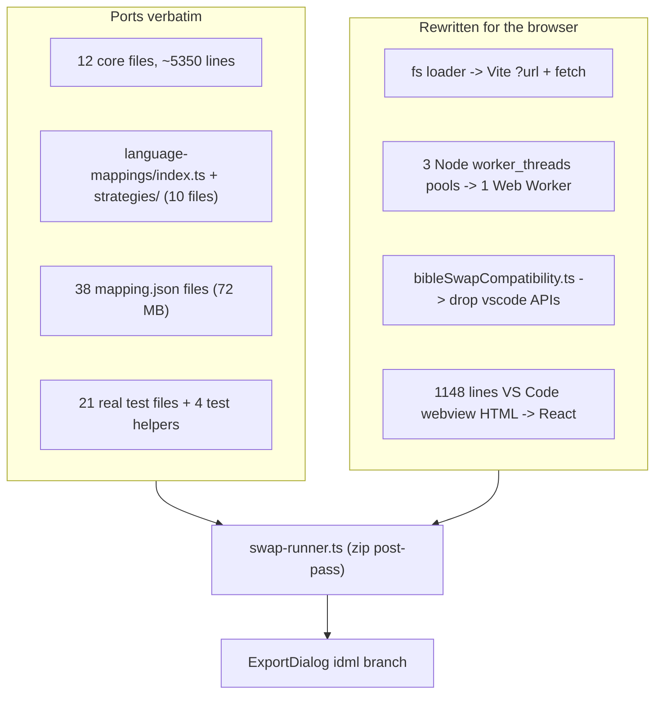

# Bible Swap — port from codex to Aquilla

Port the Bible Text Swap feature from the codex-editor branch
`912-make-a-new-bible-text-swap-feature-for-biblica-global-publishing` into Aquilla, as an
optional pass on top of the existing Biblica Study Notes round-trip IDML export.

- **Source repo:** `c:\Users\marti\Desktop\FrontierRnD\Codex\codex-editor` (branch checked out)
- **Source dir:** `webviews/codex-webviews/src/NewSourceUploader/importers/biblica/bible-swap/`
- **Target dir:** `src/lib/biblica/bible-swap/`
- **Decisions taken:** mappings committed into the target dir (codex layout) and loaded lazily
  via Vite `?url` + `fetch`; the compatibility-report panel is ported in full.

---

## Why this is tractable

The codex swap engine already lives in the **webview (browser)** layer, not the extension host.
All 12 core files were verified Node-free (no `fs` / `path` / `worker_threads` / `node:` imports),
so they port verbatim. The swap is also cleanly decoupled from note injection: it is a post-pass
over the finished IDML zip that rewrites `Stories/*.xml` and never touches the notes splice.



### Codex integration contract being reproduced

```
biblicaExporter.ts:1772  if (options?.bibleIdmlData) -> applyBibleSwapPass(zip, ...)
biblicaExporter.ts:1816  applyBibleSwapPass: read largest Stories/*.xml from Bible IDML
biblicaExporter.ts:1914  spliceBibleSwapIntoZip: for each study Stories/*.xml ->
                         applyBibleSwapWithShared(studyXml, bibleXml, mode, shared,
                           { versificationPlan, studyScan, language, studyVolume })
biblicaExporter.ts:1786  failure is NON-FATAL - notes-only IDML still exports
```

---

## Phase 1 — Port the core engine

Copy into `src/lib/biblica/bible-swap/`, preserving the codex folder layout. All internal imports
are relative and stay valid, so **no path rewriting is required**.

**Core (12 files, ~5350 lines):** `index.ts` (186), `types.ts` (53), `verseMarkers.ts` (56),
`paragraphStyleRoles.ts` (40), `bibleVerseIndexSerialize.ts` (46), `paragraphIndex.ts` (91),
`psalmVersification.ts` (140), `compatVerseIndex.ts` (192), `versificationPlan.ts` (830),
`structureSwap.ts` (872), `chapterBlocks.ts` (1374), `surgicalSwap.ts` (1474).

**Strategies (10 files):** `language-mappings/strategies/{any,arabic,french,hindi,index,marathi,portuguese,russian,types,ukrainian}.ts`
plus `language-mappings/index.ts`.

**Mappings (72 MB):** `language-mappings/{portuguese,russian,french,hindi,marathi,arabic,ukrainian}/`
containing `{GEN-DEU,JOS-EST,JOB-SNG,ISA-MAL,MAT-JOHN,ACT-REV}.mapping.json`, the matching
`.mapping.md` docs, and `_language-summary.json`. Ukrainian ships only `MAT-JOHN` + `ACT-REV`.

**Explicitly excluded:** the 27 `*.debug.test.ts` files and the `.mjs` / `.py` / `.txt` diagnostic
dumps — they hardcode machine-local paths such as
`C:/Users/marti/Desktop/FrontierRnD/Test Files/Biblica Global Publishing/...`.

### Conformance passes — never change logic

1. `pnpm lint --fix` for formatting only (codex is 4-space + semicolons; Aquilla is 2-space, no semicolons).
2. Replace any `any` with a real type — repo rule in `CLAUDE.md`.
3. Verify against `tsc -b`, not `tsc --noEmit` — the CI gate per `AGENTS.md` catches
   `erasableSyntaxOnly` / project-reference errors that `--noEmit` misses.

`surgicalSwap.ts` and `chapterBlocks.ts` exceed the repo's ~500-line guideline. Keep them intact
and note the exception in a header comment: byte-fidelity with the working codex implementation is
worth more than splitting the files.

- [ ] Copy core + strategies + mappings
- [ ] Formatting / `any` / `tsc -b` conformance
- [ ] `pnpm test src/lib/biblica/bible-swap` compiles and collects

---

## Phase 2 — Browser mapping loader

**New:** `src/lib/biblica/bible-swap/mapping-loader.ts`, replacing codex's Node-only
`src/projectManager/utils/bibleSwapLanguageMappings.ts`.

Preserve exactly: the `planCache`, the `isUsableMappingPlan` gate, `studyVolumeFromFileName`
resolution, and the "return null -> fall back to analyze-at-export" contract. Only the read changes.

```ts
const MAPPING_URLS = import.meta.glob(
  "./language-mappings/*/*.mapping.json",
  { query: "?url", import: "default", eager: true }
) as Record<string, string>
```

Vite emits each JSON as a separate hashed asset, so **nothing enters the JS bundle** and exactly one
file (2.6 MB worst case, `russian/JOS-EST`) is fetched per export. `loadBibleSwapMappingPlan`
becomes `async`; its return shape `{ volume, plan, language } | null` is unchanged.

Preserve the codex fall-back behaviours verbatim:
- Ukrainian volumes are marked unusable (0% projected match) and silently fall back to
  analyze-at-export. Do not "fix" this.
- Volume ids resolve through suffixes: `JOS-EST-biblica.idml`, `ISA-MAL-313c6d48-….codex`,
  `JOB-SNG (1).idml` all map to their base volume.

- [ ] `mapping-loader.ts` with URL glob + cache + usability gate
- [ ] `mapping-loader.test.ts` covering usable/unusable and suffixed file names

---

## Phase 3 — Swap runner and Web Worker

**New:** `src/lib/biblica/bible-swap/swap-runner.ts` — port of `applyBibleSwapPass` /
`spliceBibleSwapIntoZip` (`biblicaExporter.ts:1770-2000`) onto JSZip (already a dependency,
`jszip@^3.10.1`).

Flow, matching codex step for step:
1. Validate the Bible IDML bytes start with the `PK` ZIP signature.
2. Read the largest `Stories/*.xml` from the Bible IDML as `bibleStoryXml`.
3. `buildBibleSwapSharedResources(bibleStoryXml, mode, language)` once.
4. For every study `Stories/*.xml`: `applyBibleSwapWithShared(...)`, write the result back.
5. Aggregate into a `BibleSwapReport` (replaced verses, missing, extras appended, psalm offsets/inserts).
6. **Any failure is non-fatal** — log and return the unmodified notes-only IDML.

**New:** `bible-swap.worker.ts` + `bible-swap-worker-client.ts`, collapsing codex's three
`worker_threads` pools (`bibleSwapApplyPool`, `bibleSwapCompatWorkerPool`, `bibleSwapAnalysisPool`)
into a single Web Worker. Follow the request-id / progress / cancel protocol already established in
[src/lib/idml/idml-worker-client.ts](src/lib/idml/idml-worker-client.ts). Use a **separate** worker
from the IDML one so swap and IDML work can overlap.

**Hook point** — [src/components/ExportDialog.tsx](src/components/ExportDialog.tsx), immediately
after the existing IDML export, leaving the IDML engine untouched:

```585:602:src/components/ExportDialog.tsx
} else if (fmt === "idml") {
  const rawBytes = await fetchSourceSidecar({ projectId, fileId: activeFileId, getToken, targetLang })
  const { exportIdml } = await import("@/lib/export/exporters/idml")
  const result = await exportIdml(rawBytes, cells)
  downloadBlob(result.blob, `${baseName}.idml`)
```

- [ ] `swap-runner.ts`
- [ ] `bible-swap.worker.ts` + client
- [ ] Wire into the `fmt === "idml"` branch, behind "a mode is selected AND a Bible file is chosen"

---

## Phase 4 — Compatibility analyzer

**New:** `src/lib/biblica/bible-swap/compatibility.ts`, ported from
`src/projectManager/utils/bibleSwapCompatibility.ts` (399 lines).

Keep the `BibleSwapCompatibilityReport` shape identical: `booksFound/Expected`,
`chaptersFound/Expected`, `versesMatched/Expected`, `hasPsalms`, `perBookMismatches`,
`versificationPlan` summary, `versificationChanges`.

Two substitutions only:
- `vscode.workspace.fs.readFile(bibleUri)` -> the user-picked `File` from the export dialog.
- `resolveOriginalFileUri(...)` for the study original -> the existing `fetchSourceSidecar()`.

Keep codex's JSZip byte-copy guard (`new Uint8Array(data)` when `byteOffset !== 0`) — it prevents
"End of data reached … Corrupted zip?" on pooled buffers.

Progress callbacks (`BibleSwapProgressCallback`) drive the UI progress bar.

- [ ] `compatibility.ts` running inside the worker
- [ ] Report surfaces through the worker client with progress events

---

## Phase 5 — Export UI

**New:** `src/components/export/BibleSwapPanel.tsx`, rendered from `ExportDialog` when
`format === "idml"`. React rewrite of codex's `projectExportView.ts:2401-2522` markup.

### Gating — Study Notes imports only

Derive from cells already in scope; no new props, mirroring the existing `hasSdbhFiles` pattern:

```ts
const isBiblicaStudyNotes = cells.some(
  (c) => c.metadata?.aquillaImport?.profileId === "builtin:biblica-study-notes"
)
```

This deliberately excludes `builtin:biblica-treasure-hunt` and `builtin:biblica-reach4life`.

### Panel contents — one-for-one with codex

- **Replacement mode** — two selectable cards, Surgical (default; content-only replacement inside
  Study CSRs) and Structure (whole chapter text blocks). Toggleable and **optional**: no mode means
  a plain notes-only export, exactly as codex behaves.
- **Bible language** — pills from `BIBLE_SWAP_LANGUAGES`: Any (default), Portuguese, Russian,
  French, Hindi, Marathi, Arabic, Ukrainian. Each language's `description` renders as the hint line.
- **Translated Bible file** — `<input type="file" accept=".idml">` following the SDBH skeleton
  picker precedent at `ExportDialog.tsx:982-998`, with name + size pill and a clear button.
- **Compatibility** — progress bar during analysis, stats grid, Psalms info callout, mismatch
  callout, and a collapsible "Planned verse changes" list.
- **Blocking rule** — export is disabled when a mode is selected without a Bible file, matching
  codex's `updateStep2Button` logic.

All copy goes through `src/lib/i18n/namespaces/importExport.ts` — an Aquilla convention with no
codex equivalent. Do not hardcode strings.

- [ ] `BibleSwapPanel.tsx` + i18n keys
- [ ] Wire state into `handleExport`
- [ ] Post-export summary status message (replaced / missing / inserted counts)

---

## Phase 6 — Tests

### Ported from codex (21 real test files + 4 helpers)

`structureSwap.test.ts` (846), `surgicalSwap.test.ts` (282), `versificationPlan.test.ts` (432),
`languageMappings.test.ts` (188), `validatorHarness.test.ts` (180), `jos-est-analysis.test.ts` (207),
`russian-chapter-inserts.test.ts` (233), `exo36-boundary.test.ts` (386),
`neh8-{coalesce,portuguese,rootcause,splice-pos}.test.ts`, `neh78-boundary.test.ts`,
`1co-boundary-bleed.test.ts`, `1sa67-boundary.test.ts`, `jon12-boundary.test.ts`,
`hag2-intro.test.ts`, `psalm-direct-swap.test.ts`, `compatVerseIndex.test.ts`,
`paragraphStyleRoles.test.ts`, `verify-mr-export.test.ts`.

Helpers: `scripts/validatorHarness.ts` (554), `scripts/boundaryTestHelpers.ts` (71),
`scripts/bibleSwapValidation.ts` (197), `scripts/mappingGenerator.ts` (288, offline regeneration).

Tests needing real Biblica IDMLs keep codex's `describe.skipIf` guard rather than failing on
machines without the fixture files.

### New Aquilla-side coverage

- `swap-runner.test.ts` — **producer/consumer composition** per `AGENTS.md` rule 12: real
  `exportIdml()` output fed through the swap post-pass and reopened with JSZip, built on
  [src/lib/biblica/__fixtures__/biblica-idml.ts](src/lib/biblica/__fixtures__/biblica-idml.ts).
  Also asserts the non-fatal path: a corrupt Bible IDML still yields a valid notes-only export.
- `mapping-loader.test.ts` — usability gating and volume resolution (Phase 2).
- `ExportDialog.bible-swap.test.tsx` — RTL: panel visible for study-notes files, hidden for
  Treasure Hunt / Reach4Life / plain IDML, export blocked when a mode is chosen with no Bible file.

### No new smoke spec

Per `AGENTS.md` rule 3 this needs no `*.smoke.spec.ts`: it is an export-dialog option, and its only
cross-layer hop (R2 source fetch via sync-worker) is already covered by the existing IDML export
journey. UI behaviour belongs in RTL.

### Commands

```bash
pnpm test src/lib/biblica/bible-swap
pnpm test src/components/ExportDialog.bible-swap.test.tsx
pnpm build   # tsc -b && vite build - the CI gate
```

---

## Risks and notes

- **Repo size:** the mappings add ~72 MB to the Aquilla git repo. Unavoidable given the decision to
  ship them in-tree like codex, and it matches what codex already carries.
- **Marathi** is included. Codex ships it even though the original request listed
  "Portuguese, French, Hindi, Russian, Ukrainian, Arabic etc."
- **Ukrainian** silently falls back to analyze-at-export (0% projected match on its volumes).
  Preserve, do not fix.
- **Bundle guard:** confirm after `pnpm build` that no `*.mapping.json` content landed in a JS
  chunk — they must appear as standalone emitted assets.
- **Memory:** structure mode holds the Bible chapter-block index plus study story XML; the Web
  Worker keeps that off the main thread. `packages/idml-roundtrip/src/archive.ts` caps input at
  128 MB / 512 MB uncompressed, which the Bible IDMLs sit well under.

## Test-impact analysis (for the final summary)

- **Changed contract:** the Biblica Study Notes IDML round-trip export gains an optional
  post-pass that rewrites `Stories/*.xml` verse content.
- **Producers:** `exportIdml()`, `fetchSourceSidecar()`, the user-supplied Bible IDML,
  `loadBibleSwapMappingPlan()`.
- **Consumers:** `swap-runner.ts` -> `applyBibleSwapWithShared` -> the downloaded `.idml`.
- **Regression tests:** `swap-runner.test.ts` (composition + non-fatal fallback),
  `mapping-loader.test.ts`, `ExportDialog.bible-swap.test.tsx`, plus the 21 ported engine suites.
